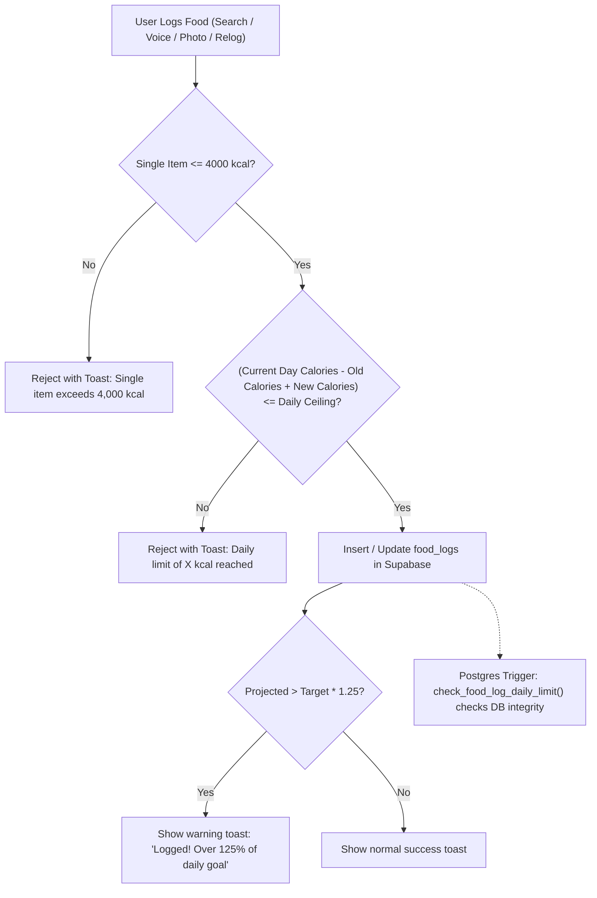

# Implementation Plan - Food Calorie Abuse Limiter

Enforce an abuse-proof limit on food calorie logging to prevent infinite or unrealistic calorie entries from skewing daily dashboards, weekly reports, and leaderboard rankings.

---

## 1. Goal Description

Currently, users can log up to 20,000 kcal per item and unlimited calories per day. This allows accidental input errors (e.g., typing 50,000 instead of 500) or deliberate gaming of the leaderboard.

This plan introduces:
1. **Per-Item Limit**: Single food item cannot exceed **4,000 kcal**.
2. **Dynamic Daily Ceiling**: Maximum allowed daily intake is:
   $$\text{Daily Ceiling} = \min(10000, \max(5000, \text{round}(\text{daily\_target} \times 2.0)))$$
   - *Example (1,500 kcal target)*: Ceiling is $\max(3000, 5000) = \mathbf{5,000\text{ kcal}}$ (permits cheat days / social dinners).
   - *Example (3,000 kcal target)*: Ceiling is $\max(6000, 5000) = \mathbf{6,000\text{ kcal}}$.
   - *Example (athlete/bulking 5,500 kcal)*: Ceiling is $\min(10000, 11000) = \mathbf{10,000\text{ kcal}}$.
3. **Soft Warning**: When logging pushes daily total over $1.25 \times \text{daily\_target}$, show a gentle informational toast ("Logged! Note: you are over 125% of your daily goal") without blocking.
4. **Hard Block**: Block logging if an entry or batch pushes the day beyond the daily ceiling, or if a single item exceeds 4,000 kcal.
5. **Two-Tier Enforcement**:
   - Client-side in `src/components/FoodSearch.tsx`, `src/routes/food.tsx`, and `src/routes/dashboard.tsx` with user-friendly error toasts.
   - Database-side via PostgreSQL `BEFORE INSERT OR UPDATE` trigger in a Supabase migration to block direct API abuse.

---

## 2. Approved Parameters

- Per-item maximum: **4,000 kcal**.
- Daily ceiling: $\min(10000, \max(5000, 2 \times \text{target}))$.
- Default target if missing: **2,000 kcal** (ceiling = 5,000 kcal).
- Soft warning threshold: $\text{target} \times 1.25$.

---

## 3. Architecture & Data Flow



---

## 4. Proposed Changes

### Core Nutrition / Limit Module

#### [NEW] `src/lib/calorieLimits.ts`
Pure functions for limit calculation and validation:
- `MAX_SINGLE_FOOD_CALORIES = 4000`
- `MIN_DAILY_CALORIE_CEILING = 5000`
- `MAX_DAILY_CALORIE_CEILING = 10000`
- `getDailyCalorieCeiling(dailyTarget?: number | null): number`
- `validateFoodLogCalories(incomingCalories: number, currentDayCalories: number, dailyTarget?: number | null, editingOldCalories?: number): { allowed: boolean; reason?: string; projectedTotal: number; maxAllowed: number; isOverSoftTarget: boolean }`

#### [NEW] `src/lib/calorieLimits.test.mjs`
Automated test suite runnable via `node src/lib/calorieLimits.test.mjs`:
- Tests valid normal meals within target.
- Tests cheat days allowed up to 5,000 kcal for 1,500 kcal targets.
- Tests rejection when single item > 4,000 kcal.
- Tests rejection when projected total exceeds ceiling.
- Tests edit behavior: replacing a 1,000 kcal item with a 1,200 kcal item recalculates correctly.
- Tests negative, NaN, and infinite inputs.

---

### UI Components & Routes

#### [MODIFY] `src/components/FoodSearch.tsx`
- Import validator from `src/lib/calorieLimits`.
- Receive `dailyTarget?: number | null` prop.
- In `logFood`:
  - When editing: pass `editLog.calories` as `editingOldCalories`.
  - Validate before inserting or updating. If not allowed, show `toast.error(reason)` and return early without inserting.
  - If allowed and `isOverSoftTarget`, display an informational warning toast.
- In `logVoiceItems`:
  - Compute total calories of incoming batch.
  - Validate total batch addition against daily ceiling. If not allowed, show clear toast error and abort before insert.

#### [MODIFY] `src/routes/food.tsx`
- Pass `profile?.daily_calorie_target` to `FoodSearch`.
- In `relogFood`:
  - Validate item calories against current day's total before inserting.
- In `copyPreviousDay`:
  - Calculate total calories of items from previous day.
  - Validate `currentDayTotal + copiedTotal <= dailyCeiling`. If exceeded, notify user with toast and abort before insert.

#### [MODIFY] `src/routes/dashboard.tsx`
- Pass `profile?.daily_calorie_target` to `FoodSearch`.
- In `relogFood`:
  - Validate item calories against current day's total before inserting.

---

### Database Migration

#### [NEW] `supabase/migrations/20260924120000_food_log_daily_limit.sql`
- Add PostgreSQL function `public.check_food_log_daily_limit()`.
- Add `BEFORE INSERT OR UPDATE` trigger on `public.food_logs`.
- Reads `daily_calorie_target` from `user_profiles`.
- Checks:
  1. `NEW.calories <= 4000`
  2. `SUM(calories) + NEW.calories <= LEAST(10000, GREATEST(5000, ROUND(daily_target * 2.0)))`
- Raises informative SQL exception if breached.

---

## 5. Verification Plan

### Automated Tests
1. Run standalone Node test suite:
   ```powershell
   node src/lib/calorieLimits.test.mjs
   ```
2. Verify TypeScript build:
   ```powershell
   npx tsc --noEmit
   ```
3. Verify ESLint & Prettier:
   ```powershell
   npm run lint
   ```

### Manual Verification
1. **Single Item Cap**: Try logging a custom food with 4,500 kcal -> verify immediate rejection with clear error message.
2. **Cheat Day Allowance**: For a user with a 1,800 kcal target, log meals totaling 4,200 kcal -> verify successful logging.
3. **Daily Ceiling Block**: Attempt to log an item that brings the day to 5,500 kcal -> verify blocked with toast showing projected vs max allowed.
4. **Edit Existing Log**: Edit an existing 800 kcal meal down to 500 kcal, or up to a valid amount -> verify update succeeds and replaces old calorie count without double-counting.
5. **Copy Previous Day**: If copying yesterday's meals would exceed today's daily ceiling -> verify operation is cleanly aborted with an error toast.
